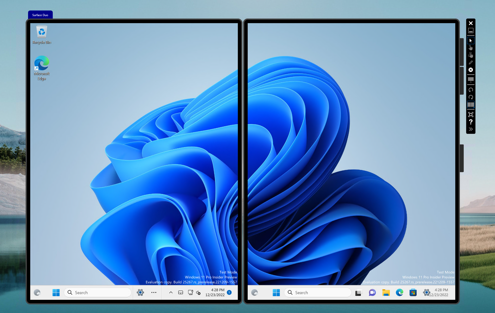

# Surface Duo Emulator Skin for Microsoft XDE Emulator



This repository contains emulator skins for use in Microsoft Emulator.

Currently only the first Surface Duo 1 topology (1350x1800) is supported

## Example Command Line

```
XDE.exe -name "Surface Duo.Gus" -vhd Windows11.vhdx -sku and -video full -memSize 6144 -nogpu -showname -displayName "Surface Duo" /addUserToHyperVAdmins "JUBULA\Gus"
```

## Extra Notes on running on ARM64 Hosts

XDE will attempt to enable nested virtualization which is not currently supported. You will need to edit the ```Microsoft.Xde.Hcs.dll``` file to change the default VM configuration. (```private static VirtualMachineSettings Microsoft.Xde.Hcs.XdeHcsVirtualMachine.CreateDefaultVMSettings(string name)```).